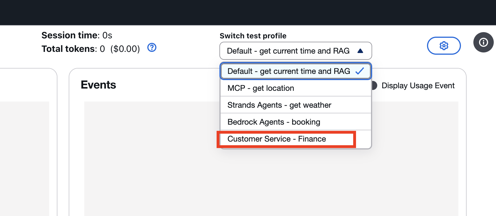

# Nova Sonic multi-agent architecture leveraging the Amazon Bedrock AgentCore

Multi-agent architecture is a widely used pattern for designing AI assistants. In a voice assistant like Nova Sonic, this architecture coordinates multiple specialized agents to handle complex tasks. Each agent can operate independently, enabling parallel processing, modular design, and scalable solutions.

In this lab, we will use a banking voice assistant as a sample to demonstrate how to deploy specialized agents on [Amazon Bedrock AgentCore](https://aws.amazon.com/bedrock/agentcore/). We will use Nova Sonic as an orchestrator to delegate detailed inquiries to sub-agents written in [Strands Agents](https://strandsagents.com/latest/documentation/docs/) hosted on [AgentCore Runtime](https://docs.aws.amazon.com/bedrock-agentcore/latest/devguide/agents-tools-runtime.html).

> While this lab demonstrates sample sub-agents using the Strands Agents framework deployed on Amazon Bedrock AgentCore, it is flexible—users can choose their preferred agent framework, LLM, and hosting options.


The conversation flow is straightforward: it begins with a greeting and collecting the user’s name, and then it can handle inquiries related to banking or mortgages. We use two sub-agents hosted on AgentCore to handle specialized logic:
- Banking Sub-Agent: Handles account balance checks, statements, and other banking-related inquiries.
- Mortgage Sub-Agent: Handles mortgage-related inquiries, including refinancing, rates, and repayment options.

Nova Sonic serves as an orchestrator to manage the overall flow and dispatch specific tasks to the sub-agents.

The sub-agents specialize in banking and mortgage logic, handling tasks such as input validation, tool selection, data source integration, and response generation. This approach encapsulates domain-specific logic at the sub-agent level, enabling a modular design and simplifying Nova Sonic’s orchestration.

> The Mortgage Agent and Banking Agent deployed on AgentCore Runtime return static responses. This sample is intended to showcase the architecture pattern and deployment process. In a real-world application, these agents would retrieve data from sources such as APIs, databases, RAG, or other backend services.

## Deploy the sub-agents to Amazon Bedrock AgentCore Runtime
Clone the repository — skip this step if you’ve already cloned the code by following the instructions in the parent folder.

```bash
git clone https://github.com/aws-samples/amazon-nova-samples
mv amazon-nova-samples/speech-to-speech/workshops nova-s2s-workshop
rm -rf amazon-nova-samples
```

Deploy the code AgentCore Runtime. For more deployment samples, refer to the [AgentCore sample repo](https://github.com/awslabs/amazon-bedrock-agentcore-samples/tree/main/01-tutorials/01-AgentCore-runtime/01-hosting-agent/01-strands-with-bedrock-model).
```bash
cd nova-s2s-workshop/agent-core
source ./deploy-agentcore-runtime.sh
```

## Test via Nova Sonic voice chat
Follow [the instructions](../README.md) at the parent level to launch the Python WebSocket and React web application. 


The Python WebSocket application will retrieve the AgentCore Runtime ARNs for the Mortgage and Banking agents from environment variables populated in the previous steps. 

Next, select the ‘Customer Service – Finance’ option from the test profile dropdown to start a bank customer service conversation. 



After providing your name, you can ask questions such as: 

```Can you check my account balance?```

```Am I eligible for refinancing?```

## Nova Sonic Multi-Agent Best Practices
Multi-agent architecture provides flexibility and a modular design, allowing builders to structure voice assistants efficiently and potentially reuse existing specialized agent workflows. However, there are some best practices specific to voice chat that are important to consider.

Best Practices:

- Balance flexibility and latency: Invoking sub-agents via Nova Sonic ToolUse events can add latency to voice responses.

- Use smaller LLMs for sub-agents: Starting with models like Nova Lite can help reduce latency.

- Optimize response length: Voice assistants benefit from shorter responses with follow-ups, improving both latency and user experience.

- Stateless vs. statefull sub-agent design: 
    - Stateless sub-agent: Handle each request independently, without memory of previous interactions. Which is simple, easy to scale, but cannot provide context-aware responses.
    - Stateful sub-agent: Maintain memory across interactions, enabling context-aware responses. Supports personalized experiences but is more complex and resource-intensive.

    So: 
    
    - Use stateless sub-agents for simple tasks and stateful ones for multi-turn or context-dependent workflows.
    - Let Nova Sonic orchestrator manage session-level state while delegating specialized tasks.